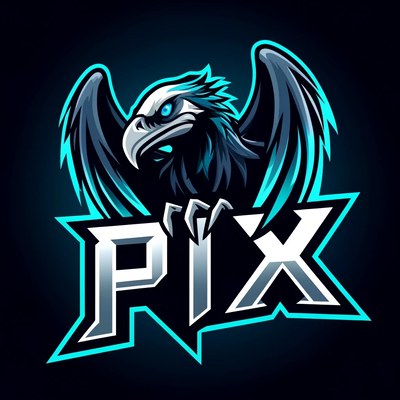
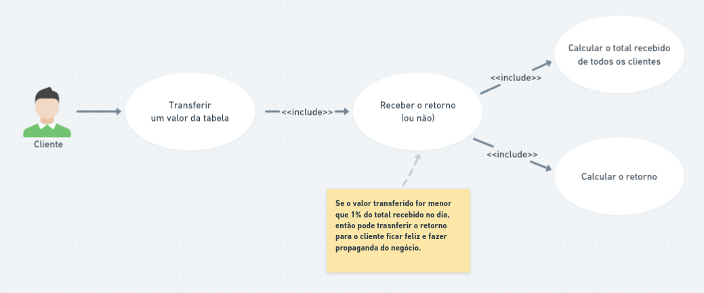
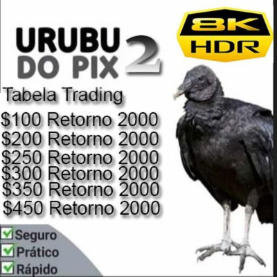

# Urubu do PIX

> PIX = Projeto Interessante para eXperimentos

Um projeto para devs experimentarem boas práticas de programação.

A ideia deste projeto é programar uma regra de negócio simples, mas aplicando conceitos avançados como SOLID, Design
Patterns,
DDD e testes automatizados.

Essa é uma boa maneira de aprender de forma prática conceitos que úteis em projetos reais e legados.

<p align="center">

</p>

## Por que Urubu do Pix?

A maioria dos brasileiros conhece o Urubu do Pix, um golpe que virou meme.

A regra de negócio apesar de muito simples, possibilita a aplicação de diversos conceitos de programação.

Se a regra de negócio fosse mais complexa, seria necessário mais tempo para entender as regras do que para aplicar os
conceitos de programação.

## Regra de negócio

Basicamente uma pessoa transfere um valor para a plataforma na expectativa de multiplicar o seu investimento de acordo
com uma tabela de retornos.

O comportamento padrão é que a plataforma não retorna o valor, ou seja, o cliente perde o dinheiro.

Mas algumas vezes a plataforma pode retornar um valor, para incentivar as pessoas a fazerem propaganda do ~~golpe~~
negócio.



Pesquisando na internet foram encontradas 3 tabelas diferentes de retornos:

|                   Imagem                    | Descrição                                                |
|:-------------------------------------------:|:---------------------------------------------------------|
|  | A versão original com ganhos de 10x!                     |
|  | Versão 8K HDR, com retorno fixo, não faz sentido nenhum. |
|  | Verão 16k Ultra HD, essa paga mais porque paga em dólar. |

## Como iniciar e testar o projeto

Para rodar este projeto você precisará ter `Docker` e `Docker Compose` instalados.

Siga estes passos para configurar seu ambiente e executar os testes:

Inicie os containers:

```bash
docker-compose up -d
```

Acesse o container do PHP:

```bash
docker-compose exec app bash
```

Instale as dependências:

```bash
composer install
```

Execute as migrações do Phinx:

```bash
vendor/bin/phinx migrate
```

Execute os testes automatizados:

```bash
vendor/bin/phpunit
```

## Code Coverage

O Code Coverage é uma técnica que mede a quantidade de código que é coberta por testes automatizados.

O objetivo é garantir que todas as partes do código sejam testadas, evitando bugs e melhorando a qualidade do software.

Execute os testes automatizados com Code Coverage:

```bash
vendor/bin/phpunit --coverage-html coverage
```

Após isso você pode acessar o relatório de Code Coverage em `coverage/index.html`.


## Arquitetura

A arquitetura do projeto foi baseada no DDD (Domain-Driven Design) e no Clean Architecture.

A ideia é separar as responsabilidades em camadas, facilitando a manutenção e a evolução do software.

- `db`: Configuração do banco de dados.
- `src`: Código-fonte do projeto.
    - `Components`: Responsável por armazenar classes que podem ser reutilizadas em outros projetos.
        - `Trade`: Responsável por armazenar exceções personalizadas.
            - `Application`: Responsável por orquestrar as ações do sistema.
            - `Domain`: Responsável por representar as regras de negócio.
            - `Infrastructure`: Responsável por implementar as interfaces da camada de domínio.
    - `Models`: Modelos de dados.
- `tests`: Testes automatizados.
    - `Integration`: Testes de integração.
    - `Unit`: Testes unitários.

## Conceitos aplicados neste projeto

- Testes automatizados
    - TDD
    - Integration Tests
    - Unit Tests
    - Code Coverage
    - Mock
- DDD
    - Layered Architecture
    - Application Service
    - Entity
    - Value Object
    - Repository
- Design Patterns
    - Strategy
    - Factory
- Clean Code
    - SOLID
    - YAGNI (You Ain't Gonna Need It)
    - KISS (Keep It Simple, Stupid)
    - DRY (Don't Repeat Yourself)

## Contribuindo

Sinta-se à vontade para contribuir com o projeto, abrindo issues e pull requests.
